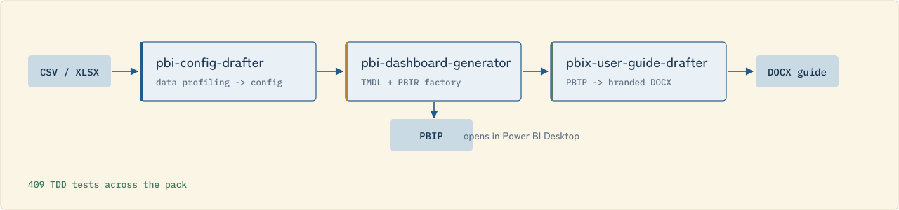

# pbi-ai-skills

[](LICENSE)
[](#verifiable-metrics)
[](#install)

**The Power BI Skill Pack for Claude Code** — from a raw CSV to a working PBIP dashboard to a branded user guide, in three routed skills.

<p align="center"></p>

## Install

```
/plugin marketplace add yujiyamane/pbi-ai-skills
/plugin install pbi-ai-skills
```

Then, in a Claude Code conversation:

```
Use the pbi-config-drafter skill to analyse my CSV at C:\data\sales.csv
```

## Skills

| Skill | What it does | Category |
|---|---|---|
| [`pbi-config-drafter`](.claude-plugin/skills/pbi-config-drafter/) | Profiles a CSV/Excel dataset (column types, cardinality, ranges) and drafts a `/*FACTORY*/` config block for approval |  |
| [`pbi-dashboard-generator`](.claude-plugin/skills/pbi-dashboard-generator/) | Runs the drafter pipeline (`parse_config` → `run_factory`) on an approved config block, outputs a full PBIP — TMDL semantic model + PBIR report |  |
| [`pbix-user-guide-drafter`](.claude-plugin/skills/pbix-user-guide-drafter/) | Parses a finished PBIP and writes a branded DOCX user guide, page by page, with screenshot placeholders (or live Playwright captures) |  |

Each skill routes to the full implementation living alongside it in this repo ([`pbi-drafter-configurator/`](pbi-drafter-configurator/), [`pbi-drafter/`](pbi-drafter/), [`pbi-user-guide-drafter/`](pbi-user-guide-drafter/)) — those are also fully self-contained skills in their own right, plus two more:

| Raw skill | What it does |
|---|---|
| [`pbi-tester`](pbi-tester/) | Static PBIP/PBIR/TMDL quality analysis — 50+ checks across 10 categories, no PBI Desktop required |
| [`pbi-deployer`](pbi-deployer/) | One-command deploy to Power BI Service / Microsoft Fabric via `fabric-cicd` |

## Architecture

<p align="center"> pbi-config-drafter -> pbi-dashboard-generator -> pbix-user-guide-drafter -> DOCX guide, with PBIP opening in Power BI Desktop" width="100%"></p>

## Other agents (Agent Skills open standard)

The 5 raw skills (`pbi-drafter`, `pbi-drafter-configurator`, `pbi-user-guide-drafter`, `pbi-tester`, `pbi-deployer`) are fully self-contained and install into any agent supporting the [open Agent Skills standard](https://github.com/vercel-labs/skills) (Gemini CLI, GitHub Copilot, Amp, and others):

```
npx skills add yujiyamane/pbi-ai-skills
```

`.github/skills/` mirrors the same 5 for GitHub Copilot's own workspace convention.

The 3 curated wrapper skills above are Claude Code plugin-only by design — they route via the plugin's own directory layout, which only the plugin loader preserves.

## Verifiable metrics

**409 TDD tests** across `pbi-drafter` (350) and `pbi-user-guide-drafter` (59):

```bash
python -m pytest pbi-drafter/tests pbi-user-guide-drafter/tests -q
# 368 passed, 41 skipped (Playwright / optional-dependency tests)
```

## Repository structure

```
pbi-ai-skills/
├── .claude-plugin/
│   ├── plugin.json                 # declares skills at ./.claude-plugin/skills/
│   ├── marketplace.json
│   └── skills/                     # 3 curated wrapper skills (Claude Code plugin only)
│       ├── pbi-config-drafter/
│       ├── pbi-dashboard-generator/
│       └── pbix-user-guide-drafter/
├── pbi-drafter/                     # dashboard generator — 350 TDD tests
├── pbi-drafter-configurator/        # config block drafter
├── pbi-user-guide-drafter/          # DOCX user guide generator — 59 TDD tests
├── pbi-tester/                      # static quality analyser
├── pbi-deployer/                    # fabric-cicd deploy wrapper
├── .github/skills/                  # Copilot-compatible mirrors of the 5 raw skills
├── design/                          # Hokusai asset pipeline (banner, diagram, social preview)
├── assets/                          # generated banner.svg, architecture.svg, social-preview.png
└── sanitize.ps1
```

## Installation (Python dependencies)

```bash
pip install python-docx        # pbi-user-guide-drafter
pip install fabric-cicd        # pbi-deployer
pip install playwright && playwright install chromium   # optional — live screenshot capture
```

## License

MIT — see [LICENSE](LICENSE).

## Contributing

PRs welcome. Skills must include a `SKILL.md` and, where applicable, a `tests/` folder with passing tests.
